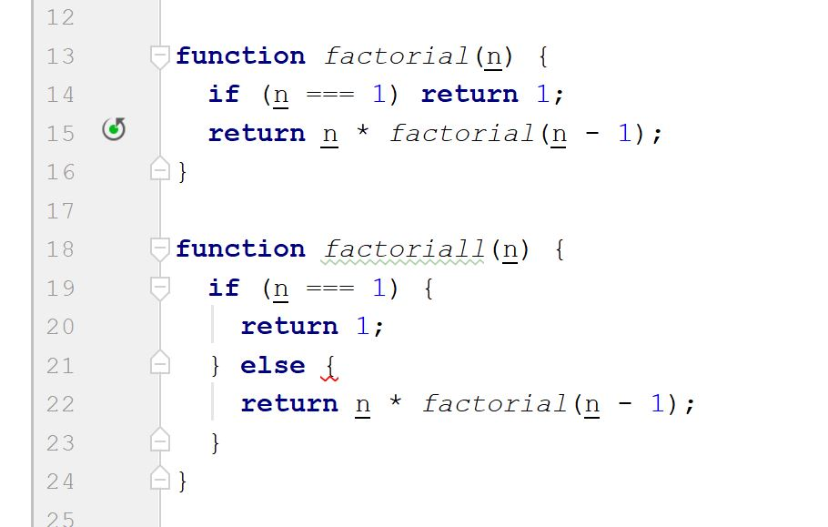

---
layout: essay
type: essay
title: Benefits of Coding Standards
# All dates must be YYYY-MM-DD format!
date: 2018-09-20
labels:
  - Coding Standards
  - Javascript
---

<h2>Introduction  </h2>

A coding standard includes naming conventions, formatting and indentation, classes and interfaces and so on [1].
It helps programmers to maintain their codes or read codes are written by other people easily. However, coding standards are not just a set of guidelines for programming language. It is also a tool that helps us learn programming language. In the rest of this essay, I will show the benefits of coding standards and  the ways that coding standards help us learn programming languages.

<h2>Coding standards make coding easier  </h2>

	First of all, coding standards help people read codes which are written by other people or by ourselves. The coding standards don’t make sense to compilers because compilers only care the syntax. In fact, coding standards were developed for our convenience. For example, I wanted to reuse a part of code that I finished last semester, but I found that I used x, y, z as variables in that program without any comments in order to do it fast. They are syntactically correct, but their purposes are not evident. As a result, I need to spend some time to read the code again. If I used a readable rule to name the variable, I will save time. 

	
  	Nowadays, computer programmes are very big, so teamworks are very important. Coding standards can minimize the communication because we can read the codes easily under the same standards [1]. For instance, when we see a method has a prefix "On" such as "OnCollisionEnter" or "onButtonClick", we may notice that the method relates to an event trigger. Moreover, under the same coding standard, the codes of team members can be integrated and maintained together.    
	

	
<h2>Coding standards help us learn programming languages  </h2>

  
	After my first week of using ESLint, I found an advantage of ESLint is that it forces us to write codes in an efficient way. There are two simple recursive functions shown below. Both of them syntactically correct, but the second one receives an error from ESLint: “unnecessary ‘else’ after ‘return’ ”. Some people may argue that it's nothing serious but just an extra "else". However, I think it is a way to help us understand a recusive function. A recursive function needs recursion terminations, or it doesn't stop. Usually, we put the terminations at the beginning of the function. The error message from ESLint emphasizes the importance of terminations and structure of recusive function, so this kind of message can help us improve our programming skills.  

	

<h2>Conclusion</h2>

  
	Programming just like writing a book, while coding standards are similar to academic paper formatting such as MLA or IEEE. We can put the reference at the beginning while place the abstract at the end. Readers can understand if they spend more time, but none of them would like to do that. Similarly, no one would like to read codes that don't follow any standards. On the other hand, following a good coding standard can improve our coding skill in the long run because good coding stardards lead us to program in smart and efficient ways.    

<h2>Reference</h2>

  
[1]&ensp; Valid Computing, “Benefits of Coding Standards”, [Online document]. Available: https://www.valid-computing.com/benefits-of-coding-standards.html. [Accessed: September, 2018]. 

