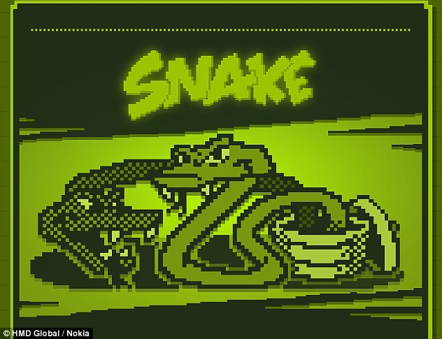

  I am a PC gamer, and I want to make my own wonderful game someday. That is  I didn’t like programming before I switched major to Computer Engineering(CENG). I still remember my first programming course in other university when I majored Mechanical Engineering. It was like a nightmare to me since I didn’t what I should do, and I just memorized some sample codes for the exams.  When I studied Electrical Engineering at UHM, I had to learn C again. At the beginning, it was still hard for me, and I needed spending lots of time to do homeworks and watch tutorials. 
	The thing got me into programming was one assignment that we needed to write our first Game, Snake, in C. It is easy to do that with Unity, but it was very hard to a beginner of C. Although that game was not perfect, it is my first game, and I was so proud of playing my own game. After that, I started to enjoy programming. 
  So far, I have learned many courses in CENG such as algorithm, cyber security and operation, but I like game development most. Unity is a great game engine that helps us develop games easily and fast. Therefore, the skills and experiences I want to develop in future are Unity and C#. There are many useful features that I don’t know. 

