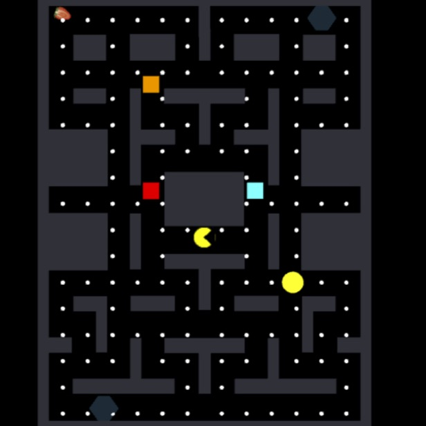

  

  As a final project for EE 491F, our team decided to create a clone of the popular arcade game, Pacman. In this game, player spawns as Pacman in a maze with 4 different ghosts: Blinky, Inky, Pinky, and Clyde. The objective of the game is to collect all of the “dots” that are scattered throughout the entire maze while avoiding the ghosts.  If one of the ghosts touches the Pacman, he’ll die, respawn, and one of his lives will be deducted from his total life count.  If Pacman’s total life count reaches 0, the game is over. 

  There are also special dots and fruits, when collected, will trigger special events. Every collectible in the game provides a different score value that is added to your total score upon collection. We made this game in Unity, and the codes were written in C#.

Source code: <a href="https://github.com/dawei-yang/Pacman"><i class="large github icon "></i>dawei-yang/Pacman</a>
