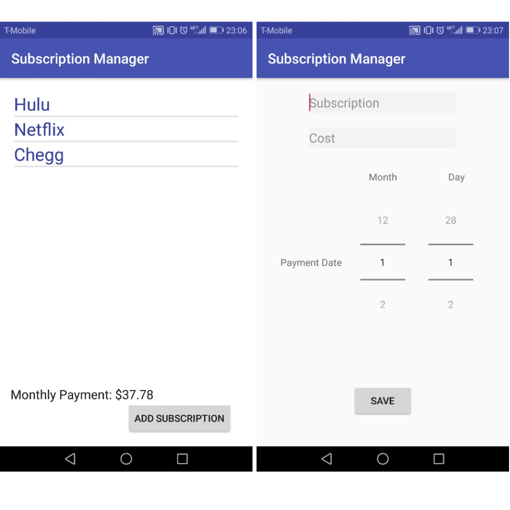

  

Proposed, designed and developed an Android app that manages their subscriptions of users.
The app lists subscriptions, synchronizes subscription payments with Google Calendar, and keeps track of total payments.
Compared to the other apps in Play Store, it can add the subscriptions into Google Calendar
The Main screen is shown in the left of Figure 1, while the right is the Add Subscription screen. 
All the subscriptions are shown in a ListView, and the monthly payment is shown in the right corner. 
Users can click the ADD SUBSCRIPTION button to go to the right screen. By clicking SAVE button, the subscription save to the SQLite as well as Google Calendar.
Users can also modify their subscriptions by click the ListView, and the app will go to the Edit screen which is similar to the Add Subscription screen.  

Source code: <a href="https://github.com/dawei-yang/EE396_E13"><i class="large github icon "></i>dawei-yang/EE396_E13</a>

