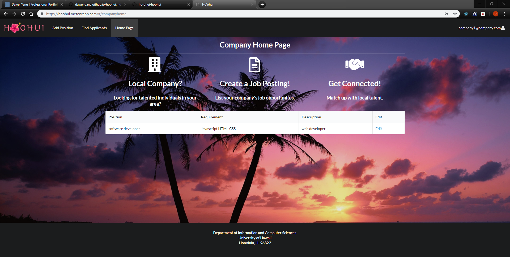
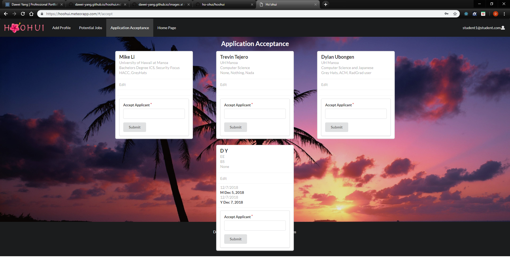

<h2> Goal</h2>

 Our goal was to create a convenient web application that connects students and companies with job opportunities.  We used the HTML, CSS, and Javascript along with React framework to develop this application which allows students or companies to create their own account. Companies can post new positions. Each position must have name, requirement, description. Meanwhile, the students can create their profiles which contain their skills and interests. This app We also deployed it in Galaxy.

    Company users are allow to review all the students' profiles, and they are able to send messeges to those whom they are interested in. Students can see the messeges that are attached in their own profiles and reply to the companies that they want to apply. Admin can see all the profiles and positions and delete those that are not appropriate.

  
 
<h2> Design pattern and project management </h2>

  We decided to use MVC design pattern and adopted the <a href="https://ics-software-engineering.github.io/meteor-application-template-react/" >meteor-applacation-template-react template</a>. In this case, MongoDB is the model, and Blaze is the view, and FlowRouter is the controller. Because we had done some practices before, it was easy to start our project with this. 
 We used Git Hub to manage our project. There are three Milestones each contains eight issues. Each person was assigned two issues, but only one should be in process. Every issue should have a branch. 

<h2> Implementation </h2>

On of the most significant work I did was to implement the login system. Companies and students use the same login option, and the system should determine the current user belongs to a company or a student and route the correct pages and components. In order to do this, I did some research about the user library of Meteor. There are several approaches. I decided to use the profile field in the user account because that field exists in every user account. If a company sign up, a messege "company" will be added into that field, while a student will be marked as "student". When a user logs in successfully, the system looks at that field and redirects the user to the corresponding page. Moerover, I needed to publish the "profile" field, so I can subscribe it in the login page. 

<h2> Conclusion </h2>

 

Source code: <a href="https://github.com/ho-ohui/hoohui"><i class="large github icon"></i>hoohui</a>

Home page: <a href="https://ho-ohui.github.io/">hoohui</a>

