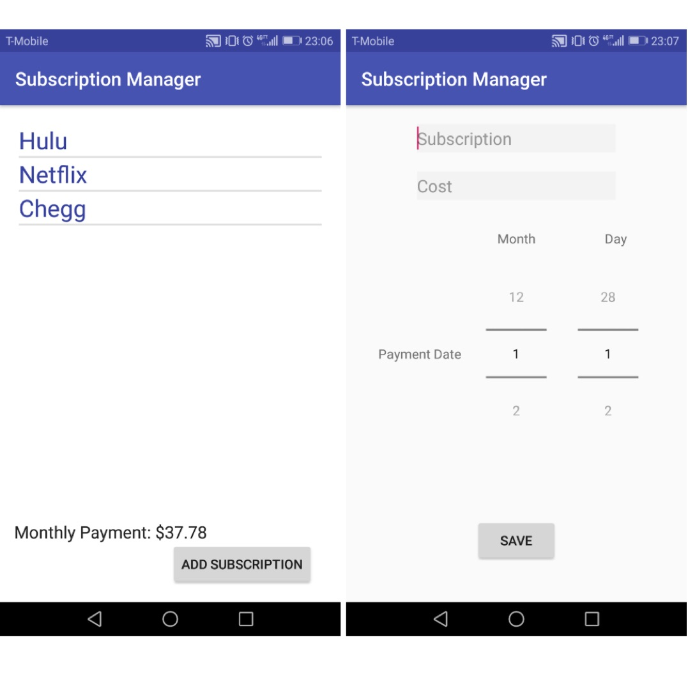

<h2> Introduction</h2>

  Hulu, Netflix, Chegg... more and more subscription we subscribe recently. It is necessary to keep track how much we pay every month. In our EE396 project, my team proposed, designed and developed an Android app that manages subscriptions of users.
The app lists subscriptions, synchronizes subscription payments with Google Calendar, and keeps track of total payments.
Compared to the other apps in Play Store, it can add the subscriptions into Google Calendar.

<h2> Design and Development </h2>

  The main screen of this app lists all the subscriptions and sums up the total monthly cost. User can enter subscriptions in the secondary screen. We created this app with Android Studio, and we also used the SQLite library and Google Calendar API.
All the subscriptions are shown in a ListView, and the monthly payment is shown in the right corner. User can click the existing subscription in the ListView, and the app will go to the third screen where user can update or delete the selected subscription.

My job was to figure out how to switch in different activities and how to use the API of Google Calendar. We decided to use SQLite database to store data. Once user enter a new subscription the date and cost will be stored in the database. Every time the app switches to main screen, the listview will update the data.  

 
Source code: <a href="https://github.com/ho-ohui/hoohui"><i class="large github icon "></i>hoohui</a>
