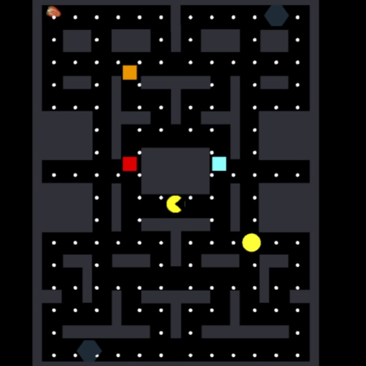

  

  As a final project for EE 491F: Multimedia Programming Foundations, our team decided to create a clone of the popular arcade game, Pacman.  In this game, you spawn as Pacman in a maze with 4 different ghosts: Blinky, Inky, Pinky, and Clyde.  The objective of the game is to collect all of the “dots” that are scattered throughout the entire maze while avoiding the ghosts.  If one of the ghosts touch Pacman, he’ll die, respawn, and one of his lives will be deducted from his total life count.  If Pacman’s total life count reaches 0, the game is over.  There are also special dots and fruits, when collected, will trigger special events. Every collectible in the game provides a different score value that is added to your total score upon collection.  Many retro arcade games are fairly simple in complexity, without too much game logic to implement and this reason served as our motivation for choosing to recreate Pacman.
